# Automate Talenta ClockIn - Clock Out

## Documentation
This documentation will provide a tutorial for using manual and automatic clock-in and clock-out "talenta" applications via web https://hr.talenta.co

### Preperation

- Fork this repo
	- 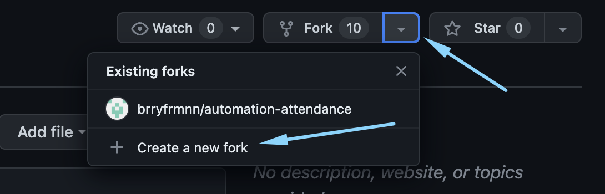
	- 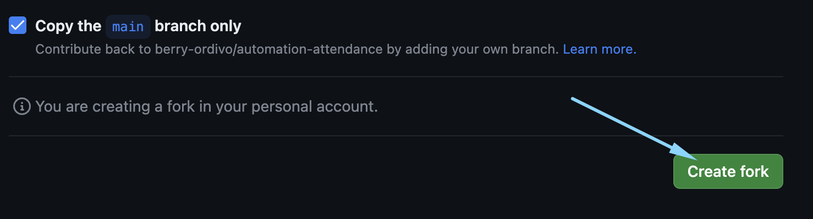
- create a repository secret in the settings - secrets and variables - action menu in your repository (example: **https://github.com/{your-github-username}/automation-attendance**)
	- 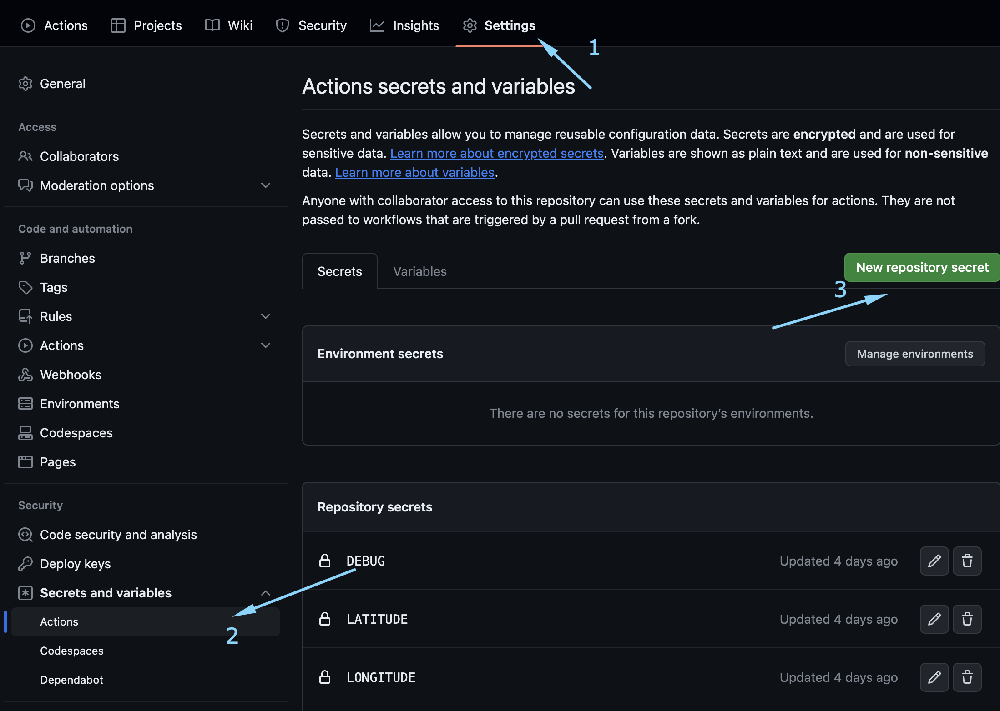
	- 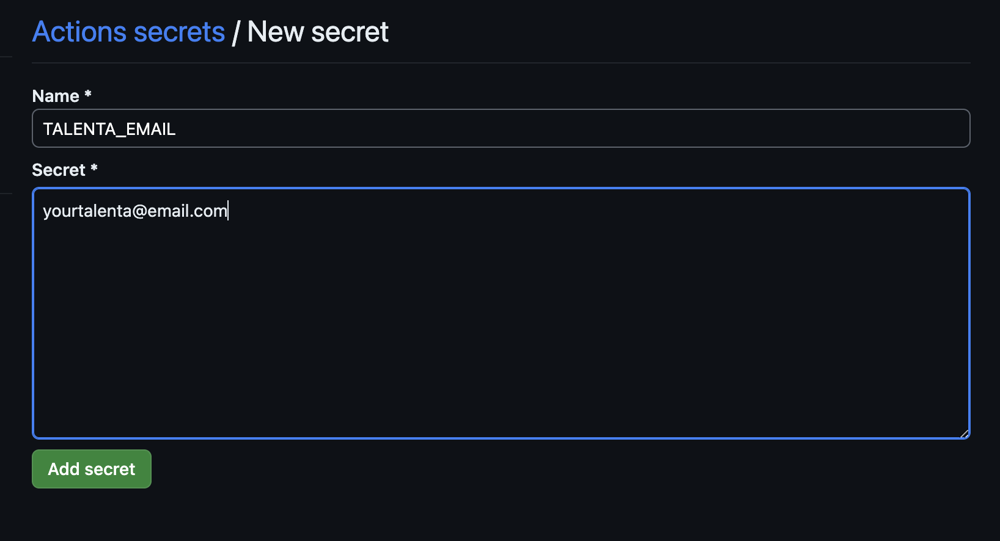
- then, create a secret like this
	- 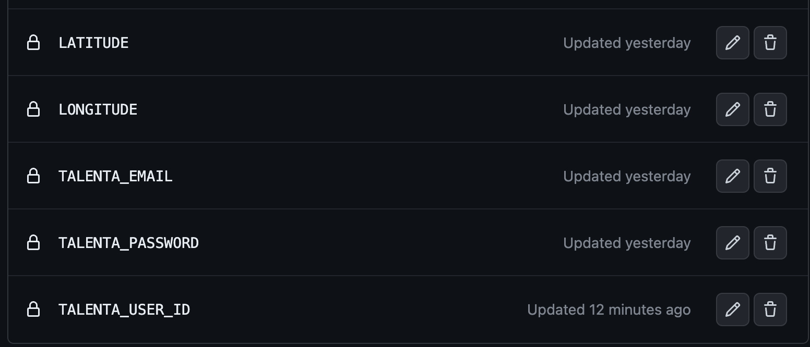
- get your langitude and longitude from gmaps
	- 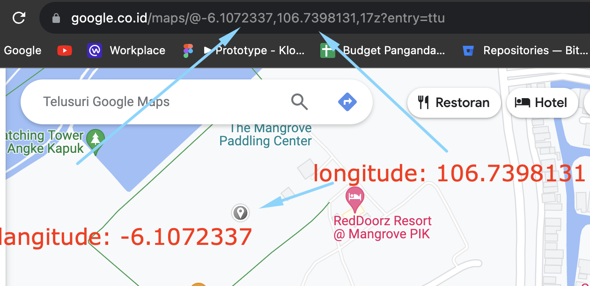
- get your user_id by inspecting the element and get MOE_DATA from local storage
	- 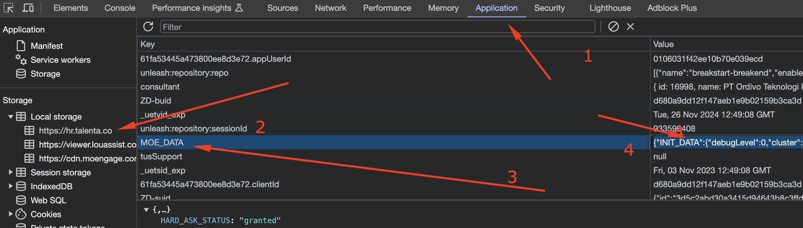
- find USER_ATTRIBUTE_UNIQUE_ID from the value of MOE_DATA then get the first string before "_" symbol, ex: XXXXX_YYY (XXXXX is your user_id and YYYY is organization id )
- go to action tab and accept the tnc
	- 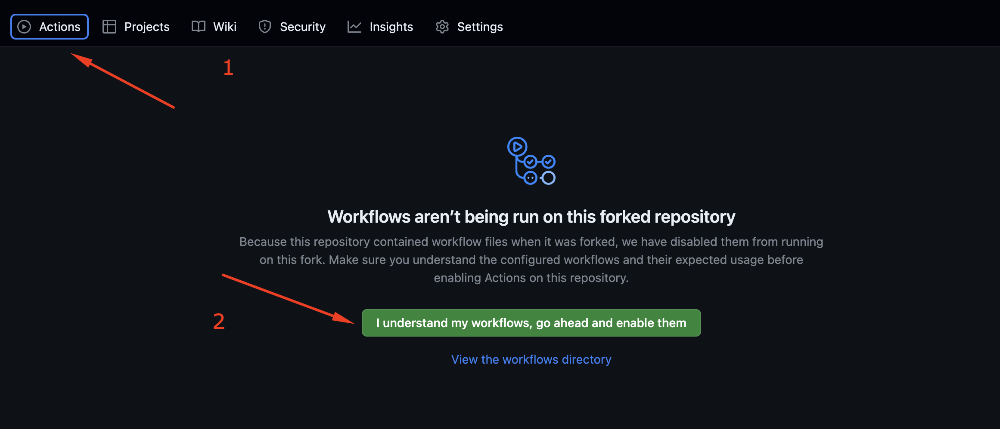
- Go to check workflow to check whether all the settings in the repository secret are correct
	- 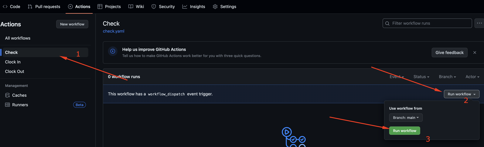
	- if your check is failed, then you must insert repository secret correctly
	- 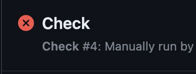
	- next setting for clockin - clockout if your check is success
	- 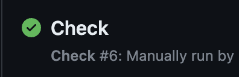
- Enable Clock-in and Clock-out action
	- 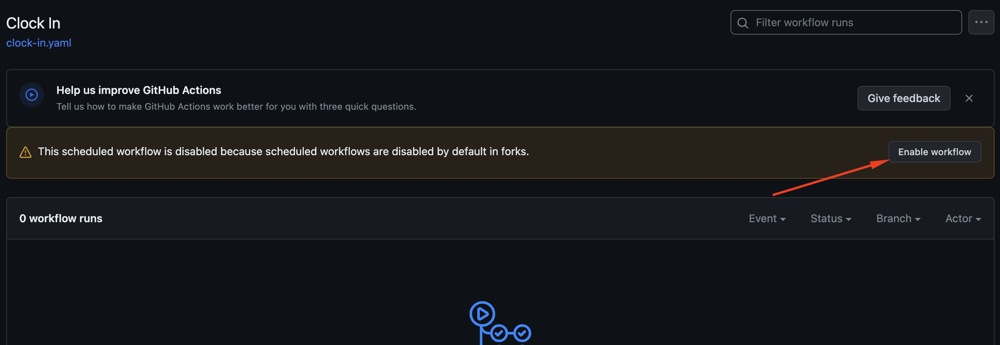
- The clock-in schedule is set at around 7.30-08.30 and the clock-out is set at around 17.00 - 18.00. Sometimes the clock-in shows more time than specified due to the system queue, if possible I recommend manual clock-in
	- you can run workflow manually or You can wait for the schedule to run
	- 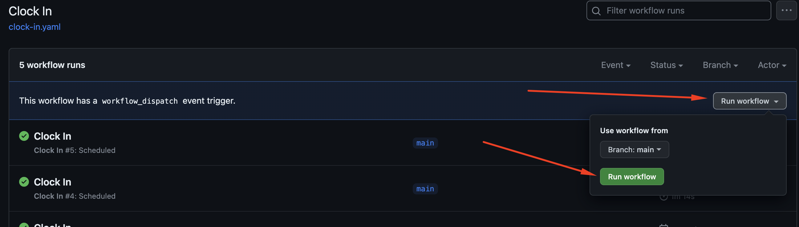

### Additional
- You can change the schedule if your time scheme is different. setting schedules using crontab, make sure you understand the rules in crontab
	- 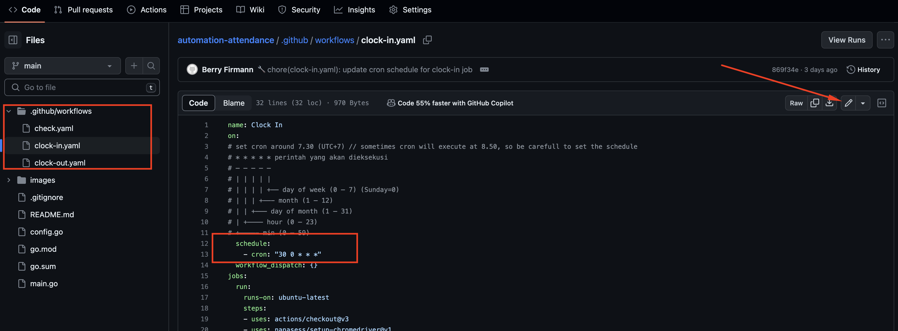
    - 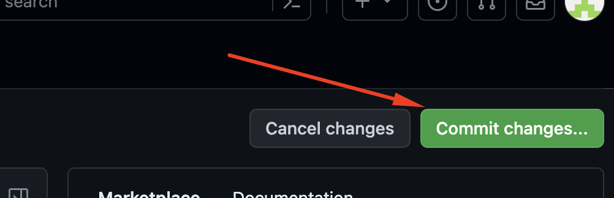
    - 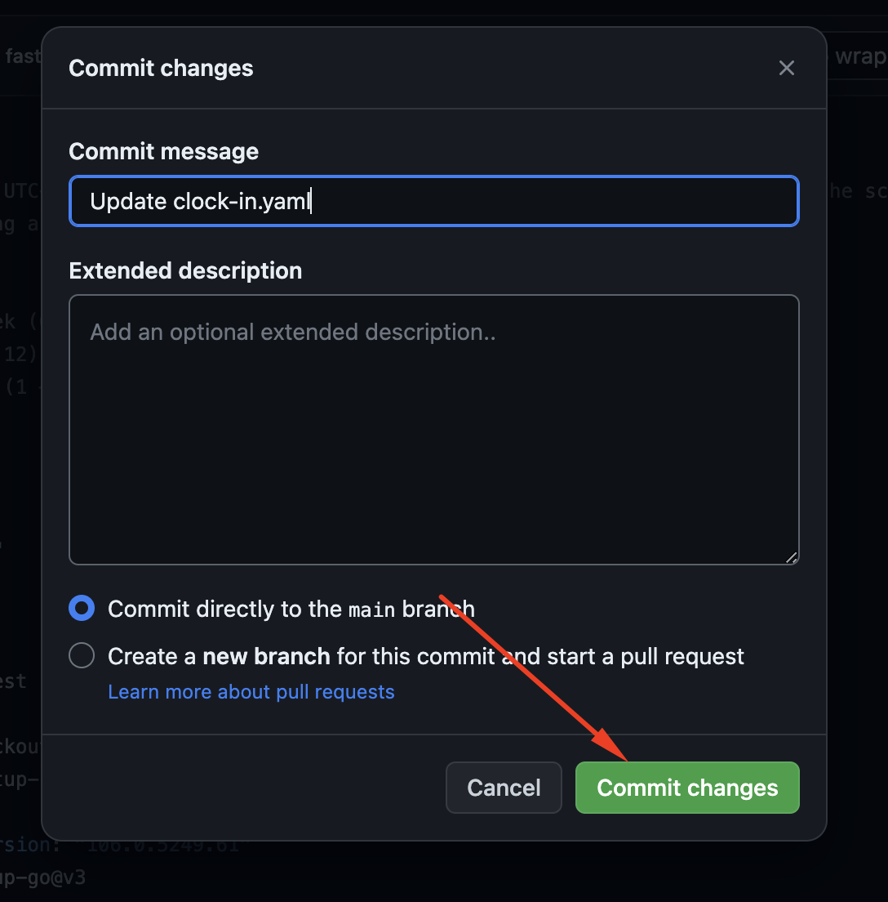
